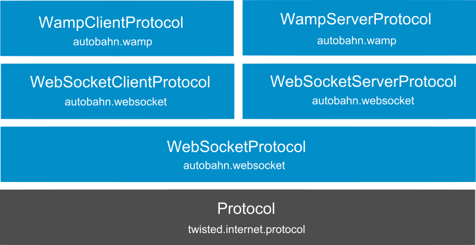
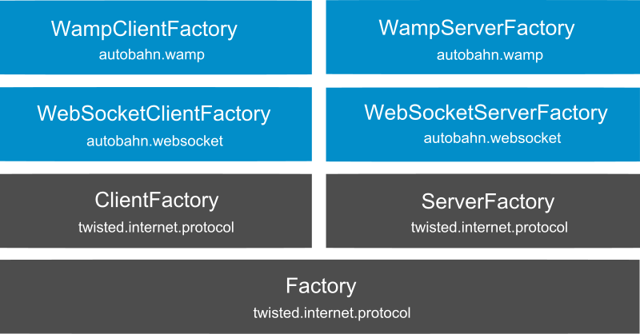

Autobahn WebSockets for Python Documentation
============================================

WebSockets Features
-------------------

*Autobahn WebSockets for Python* provides an implementation of the WebSockets protocol
which can be used to build WebSockets clients and servers.

The implementation is compliant to the WebSockets `protocol draft version 13 <http://tools.ietf.org/html/draft-ietf-hybi-thewebsocketprotocol-13>`_,
and supports draft versions starting from 10.

   * usable for clients and servers
   * easy to use basic API
   * advanced API for frame-based/streaming processing
   * very good `standards conformance <http://www.tavendo.de/autobahn/testsuite.html>`_
   * high performance `Twisted-based <http://twistedmatrix.com>`_

RPC/PubSub Features
-------------------

Additionally, *Autobahn WebSockets for Python* provides an implementation of the
`WebSocket Application Messaging Protocol (WAMP) <http://www.tavendo.de/autobahn/protocol.html>`_ protocol,
which can be used to build applications around
**Remote Procedure Call** and **Publish & Subscribe** messaging patterns.

   * includes Autobahn RPC/PubSub, an implementation of `WAMP <http://www.tavendo.de/autobahn/protocol.html>`_
   * simple and open protocol
   * built on *JSON* and *WebSockets*
   * provides RPC and PubSub messaging
   * usable for clients and servers

Contents
--------

.. toctree::
   :maxdepth: 2

   websocketprotocol
   websocketclient
   websocketserver
   autobahnprotocol

Protocol Classes
----------------

* :class:`autobahn.websocket.WebSocketProtocol`
* :class:`autobahn.websocket.WebSocketClientProtocol`
* :class:`autobahn.websocket.WebSocketServerProtocol`
* :class:`autobahn.autobahn.AutobahnClientProtocol`
* :class:`autobahn.autobahn.AutobahnServerProtocol`

Factory Classes
---------------

* :class:`autobahn.websocket.WebSocketClientFactory`
* :class:`autobahn.websocket.WebSocketServerFactory`
* :class:`autobahn.autobahn.AutobahnClientFactory`
* :class:`autobahn.autobahn.AutobahnServerFactory`

Indices
-------

* :ref:`genindex`
* :ref:`modindex`
* :ref:`search`
