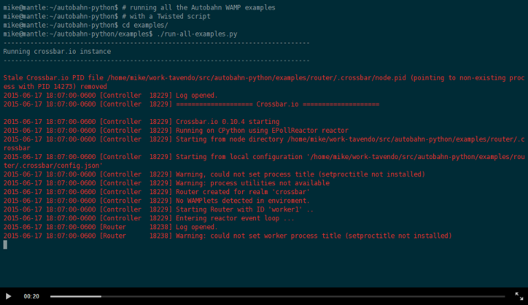

|AbL|
=====

| |Version| |Build Status| |Coverage| |Docs|

--------------

*Open-source (MIT) real-time framework for Web, Mobile & Internet of Things.*

|AbL| is part of the `Autobahn`_ project and provides open-source implementations of

* `The WebSocket Protocol <http://tools.ietf.org/html/rfc6455>`__
* `The Web Application Messaging Protocol (WAMP) <http://wamp.ws/>`__

in Python 2 and 3, running on `Twisted`_ **or** `asyncio`_.

-----

Autobahn Features
-----------------

`WebSocket`_ allows `bidirectional real-time messaging <http://crossbario.com/blog/post/websocket-why-what-can-i-use-it/>`_ on the Web while `WAMP`_ provides applications with `high-level communication abstractions <http://wamp.ws/why/>`__ (remote procedure calling and publish/subscribe) in an open standard WebSocket-based protocol.

|AbL| features:

* framework for `WebSocket`_ and `WAMP`_ clients
* compatible with Python 2.7 and 3.3+
* runs on `CPython`_, `PyPy`_ and `Jython`_
* runs under `Twisted`_ and `asyncio`_
* implements WebSocket `RFC6455`_ (and draft versions Hybi-10+)
* implements `WebSocket compression <http://tools.ietf.org/html/draft-ietf-hybi-permessage-compression>`__
* implements `WAMP`_, the Web Application Messaging Protocol
* supports TLS (secure WebSocket) and proxies
* Open-source (`MIT license <https://github.com/crossbario/autobahn-python/blob/master/LICENSE>`__)

...and much more.

Further, |AbL| is written with these goals:

1. high-performance, fully asynchronous and scalable code
2. best-in-class standards conformance and security

We do take those design and implementation goals quite serious. For example, |AbL| has 100% strict passes with `AutobahnTestsuite`_, the quasi industry standard of WebSocket protocol test suites we originally created only to test |AbL| ;)

For (hopefully) current test reports from the Testsuite see

* `WebSocket client functionality <http://autobahn.ws/reports/clients/>`_
* `WebSocket server functionality <http://autobahn.ws/reports/servers/>`_

.. note::
   In the following, we will just refer to |Ab| instead of the
   more precise term |AbL| and there is no
   ambiguity.

What can I do with Autobahn?
----------------------------

WebSocket is great for apps like **chat**, **trading**, **multi-player games** or **real-time charts**. It allows you to **actively push information** to clients as it happens. (See also :ref:`run_all_examples`)

Further, WebSocket allows you to real-time enable your Web user interfaces: **always current information** without reloads or polling. UIs no longer need to be a boring, static thing. Looking for the right communication technology for your next-generation Web apps? Enter WebSocket.

And WebSocket works great not only on the Web, but also as a protocol for wiring up the **Internet-of-Things (IoT)**. Connecting a sensor or actor to other application components in real-time over an efficient protocol. Plus: you are using the *same* protocol to connect frontends like Web browsers.

While WebSocket already is quite awesome, it is still low-level. Which is why we have WAMP. WAMP allows you to **compose your application from loosely coupled components** that talk in real-time with each other - using nice high-level communication patterns ("Remote Procedure Calls" and "Publish & Subscribe").

WAMP enables application architectures with application code **distributed freely across processes and devices** according to functional aspects. Since WAMP implementations exist for **multiple languages**, WAMP applications can be **polyglot**. Application components can be implemented in a language and run on a device which best fit the particular use case.

WAMP is a routed protocol, so you need a WAMP router. We suggest using `Crossbar.io <http://crossbar.io>`_, but there are also `other implementations <http://wamp.ws/implementations/>`_ available.

More:

* `WebSocket - Why, what, and - can I use it? <http://crossbario.com/blog/post/websocket-why-what-can-i-use-it/>`_
* `Why WAMP? <http://wamp.ws/why/>`_

Show me some code!
------------------

A sample **WebSocket server**:

.. code-block:: python

   from autobahn.twisted.websocket import WebSocketServerProtocol
   # or: from autobahn.asyncio.websocket import WebSocketServerProtocol

       class MyServerProtocol(WebSocketServerProtocol):

          def onConnect(self, request):
              print("Client connecting: {}".format(request.peer))

          def onOpen(self):
              print("WebSocket connection open.")

          def onMessage(self, payload, isBinary):
              if isBinary:
                  print("Binary message received: {} bytes".format(len(payload)))
              else:
                  print("Text message received: {}".format(payload.decode('utf8')))

              ## echo back message verbatim
              self.sendMessage(payload, isBinary)

          def onClose(self, wasClean, code, reason):
              print("WebSocket connection closed: {}".format(reason))

Complete example code:

* `WebSocket Echo (Twisted-based) <https://github.com/crossbario/autobahn-python/tree/master/examples/twisted/websocket/echo>`_
* `WebSocket Echo (Asyncio-based) <https://github.com/crossbario/autobahn-python/tree/master/examples/asyncio/websocket/echo>`_

Introduction to WebSocket Programming with |ab|:

* :doc:`websocket/programming`

---------

A sample **WAMP application component** implementing all client roles:

.. code-block:: python

    from autobahn.twisted.component import Component
    # or: from autobahn.asyncio.component import Component

    demo = Component(
        transports=[u"wss://demo.crossbar.io/ws"],
    )

    # 1. subscribe to a topic
    @demo.subscribe(u'com.myapp.hello')
    def hello(msg):
        print("Got hello: {}".format(msg))

    # 2. register a procedure for remote calling
    @demo.register(u'com.myapp.add2')
    def add2(x, y):
        return x + y

    # 3. after we've authenticated, run some code
    @demo.on_join
    async def joined(session, details):
        # publish an event (won't go to "this" session by default)
        await session.publish('com.myapp.hello', 'Hello, world!')

        # 4. call a remote procedure
        result = await session.call('com.myapp.add2', 2, 3)
        print("com.myapp.add2(2, 3) = {}".format(result))

    if __name__ == "__main__":
        run([demo])

Complete example code:

* `Twisted Example <https://github.com/crossbario/autobahn-python/blob/master/examples/twisted/wamp/overview/>`__
* `asyncio Example <https://github.com/crossbario/autobahn-python/blob/master/examples/asyncio/wamp/overview/>`__

Introduction to WAMP Programming with |ab|:

* :doc:`wamp/programming`

----------

Where to start
--------------

To get started, jump to :doc:`installation`.

For developers new to asynchronous programming, Twisted or asyncio, we've collected some useful pointers and information in :doc:`asynchronous-programming`.

For **WebSocket developers**, :doc:`websocket/programming` explains all you need to know about using |ab| as a WebSocket library, and includes a full reference for the relevant parts of the API.

:doc:`websocket/examples` lists WebSocket code examples covering a broader range of uses cases and advanced WebSocket features.

For **WAMP developers**, :doc:`wamp/programming` gives an introduction for programming with WAMP in Python using |ab|.

:doc:`wamp/examples` lists WAMP code examples covering all features of WAMP.

Get in touch
------------

Development of |ab| takes place on the GitHub `source repository <https://github.com/crossbario/autobahn-python>`_.

.. note::
   We are open for contributions, whether that's code or documentation! Preferably via pull requests.

We also take **bug reports** at the `issue tracker <https://github.com/crossbario/autobahn-python/issues>`_.

The best place to **ask questions** is on the `mailing list <https://groups.google.com/forum/#!forum/autobahnws>`_. We'd also love to hear about your project and what you are using |ab| for!

Another option is `StackOverflow <http://stackoverflow.com>`_ where `questions <http://stackoverflow.com/questions/tagged/autobahn?sort=newest>`__ related to |ab| are tagged `"autobahn" <http://stackoverflow.com/tags/autobahn/info>`__ (or `"autobahnws" <http://stackoverflow.com/tags/autobahnws/info>`__).

The best way to **Search the Web** for related material is by using these (base) search terms:

* `"autobahnpython" <https://www.google.com/search?q=autobahnpython>`__
* `"autobahnws" <https://www.google.com/search?q=autobahnws>`__

You can also reach users and developers on **IRC** channel ``#autobahn`` at `freenode.net <http://www.freenode.net/>`__.

Finally, we are on `Twitter <https://twitter.com/autobahnws>`_.

Contributing
------------

|ab| is an open source project, and hosted on GitHub. The `GitHub repository <https://github.com/crossbario/autobahn-python>`_ includes the documentation.

We're looking for all kinds of contributions - from simple fixes of typos in the code or documentation to implementation of new features and additions of tutorials.

If you want to contribute to the code or the documentation: we use the Fork & Pull Model.

This means that you fork the repo, make changes to your fork, and then make a pull request here on the main repo.

This `article on GitHub <https://help.github.com/articles/using-pull-requests>`_ gives more detailed information on how the process works.

In order to run the unit-tests, we use `Tox <http://tox.readthedocs.org/en/latest/>`_ to build the various test-environments. To run them all, simply run ``tox`` from the top-level directory of the clone.

For test-coverage, see the Makefile target ``test_coverage``, which deletes the coverage data and then runs the test suite with various tox test-environments before outputting HTML annotated coverage to ``./htmlcov/index.html`` and a coverage report to the terminal.

There are two environment variables the tests use: ``USE_TWISTED=1`` or ``USE_ASYNCIO=1`` control whether to run unit-tests that are specific to one framework or the other.

See ``tox.ini`` for details on how to run in the different environments.

Release Testing
---------------

Before pushing a new release, three levels of tests need to pass:

1. the unit tests (see above)
2. the [WebSocket level tests](wstest/README.md)
3. the [WAMP level tests](examples/README.md) (*)

> (*): these will launch a Crossbar.io router for testing

Sitemap
-------

Please see :ref:`site_contents` for a full site-map.

.. |Version| image:: https://img.shields.io/pypi/v/autobahn.svg
   :target: https://pypi.python.org/pypi/autobahn

.. |GitHub Stars| image:: https://img.shields.io/github/stars/crossbario/autobahn-python.svg?style=social&label=Star
   :target: https://github.com/crossbario/autobahn-python

.. |Master Branch| image:: https://img.shields.io/badge/branch-master-orange.svg
   :target: https://travis-ci.org/crossbario/autobahn-python.svg?branch=master

.. |Build Status| image:: https://travis-ci.org/crossbario/autobahn-python.svg?branch=master
   :target: https://travis-ci.org/crossbario/autobahn-python

.. |Coverage| image:: https://img.shields.io/codecov/c/github/crossbario/autobahn-python/master.svg
   :target: https://codecov.io/github/crossbario/autobahn-python

.. |Docs| image:: https://img.shields.io/badge/docs-latest-brightgreen.svg?style=flat
   :target: http://autobahn.readthedocs.org/en/latest/
