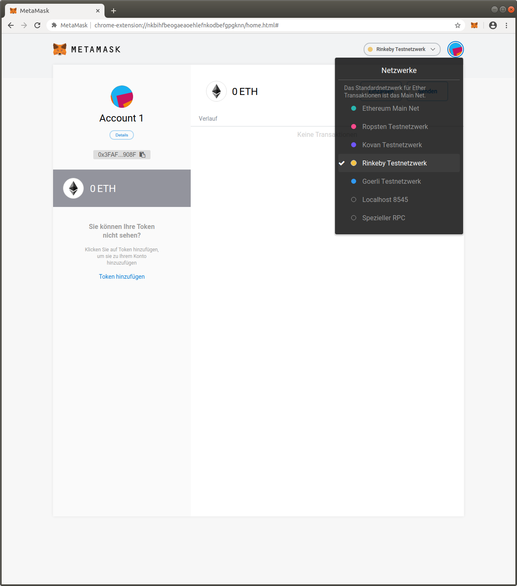
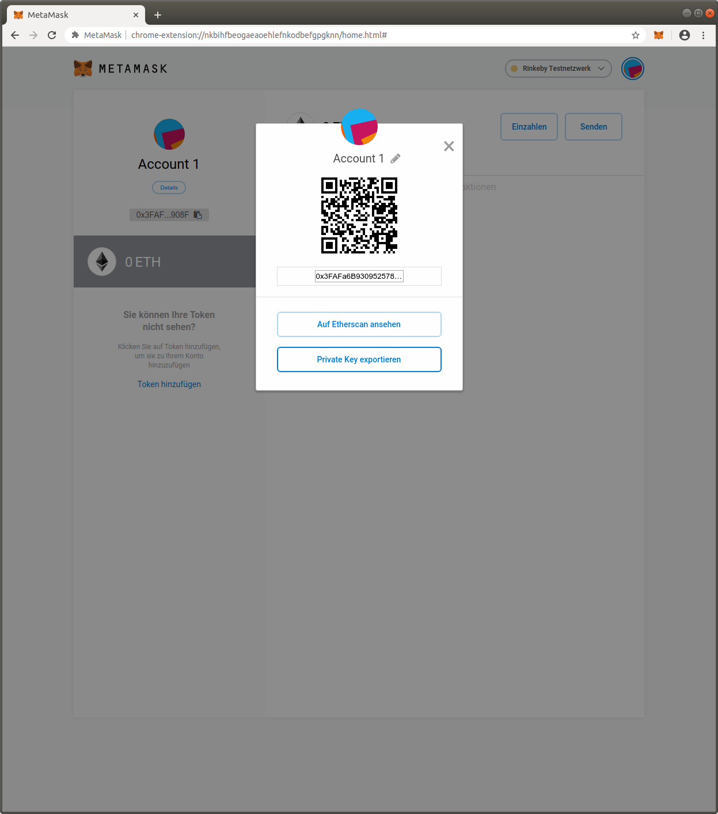
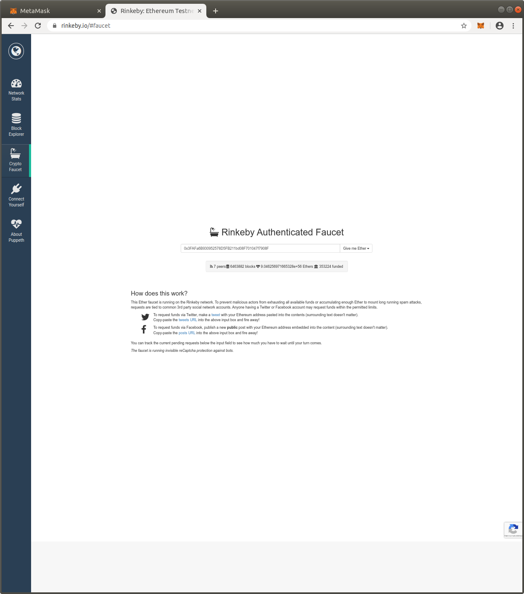

XBR Command line interface
==========================

Autobahn includes a command-line interface for the `XBR network <https://xbr.network>`__.

Status
------

* ``version``
* ``get-member``
* ``get-market``
* ``get-actor``

* ``register-member``
* ``register-member-verify``
* ``join-market``
* ``join-market-verify``
* ``create-market``
* ``create-market-verify``
* ``open-channel``
* ``get-channel``

Prerequisites
-------------

Installation
............

The XBR CLI (included in the `xbr` install flavor of Autobahn) can be installed using pip:

.. code-block:: console

    $ pip install autobahn[all]

To run the CLI and check for the installed version:

.. code-block:: console

    $ xbrnetwork version

    XBR CLI v20.5.1.dev1:

    XBRToken   contract address: 0xCfEB869F69431e42cdB54A4F4f105C19C080A601
    XBRNetwork contract address: 0xC89Ce4735882C9F0f0FE26686c53074E09B0D550
    XBRMarket  contract address: 0x9561C133DD8580860B6b7E504bC5Aa500f0f06a7
    XBRCatalog contract address: 0xD833215cBcc3f914bD1C9ece3EE7BF8B14f841bb
    XBRChannel contract address: 0xe982E462b094850F12AF94d21D470e21bE9D0E9C

To get help on the available commands:

.. code-block:: console

    $ xbrnetwork --help

    usage: xbrnetwork [-h] [-d] [--url URL] [--realm REALM] [--ethkey ETHKEY] [--cskey CSKEY] [--username USERNAME] [--email EMAIL]
                    [--market MARKET] [--market_title MARKET_TITLE] [--market_label MARKET_LABEL] [--market_homepage MARKET_HOMEPAGE]
                    [--provider_security PROVIDER_SECURITY] [--consumer_security CONSUMER_SECURITY] [--market_fee MARKET_FEE]
                    [--marketmaker MARKETMAKER] [--actor_type {1,2,3}] [--vcode VCODE] [--vaction VACTION] [--channel CHANNEL]
                    [--channel_type {1,2}] [--delegate DELEGATE] [--amount AMOUNT]
                    {get-member,register-member,register-member-verify,get-market,create-market,create-market-verify,get-actor,join-market,join-market-verify,get-channel,open-channel,close-channel}

    positional arguments:
    {get-member,register-member,register-member-verify,get-market,create-market,create-market-verify,get-actor,join-market,join-market-verify,get-channel,open-channel,close-channel}
                            Command to run

    optional arguments:
    -h, --help            show this help message and exit
    -d, --debug           Enable debug output.
    --url URL             The router URL (default: "wss://planet.xbr.network/ws").
    --realm REALM         The realm to join (default: "xbrnetwork").
    --ethkey ETHKEY       Private Ethereum key (32 bytes as HEX encoded string)
    --cskey CSKEY         Private WAMP-cryptosign authentication key (32 bytes as HEX encoded string)
    --username USERNAME   For on-boarding, the new member username.
    --email EMAIL         For on-boarding, the new member email address.
    --market MARKET       For creating new markets, the market UUID.
    --market_title MARKET_TITLE
                            For creating new markets, the market title.
    --market_label MARKET_LABEL
                            For creating new markets, the market label.
    --market_homepage MARKET_HOMEPAGE
                            For creating new markets, the market homepage.
    --provider_security PROVIDER_SECURITY
    --consumer_security CONSUMER_SECURITY
    --market_fee MARKET_FEE
    --marketmaker MARKETMAKER
                            For creating new markets, the market maker address.
    --actor_type {1,2,3}  Actor type: PROVIDER = 1, CONSUMER = 2, PROVIDER_CONSUMER (both) = 3
    --vcode VCODE         For verifications of actions, the verification UUID.
    --vaction VACTION     For verifications of actions (on-board, create-market, ..), the verification code.
    --channel CHANNEL     For creating new channel, the channel UUID.
    --channel_type {1,2}  Channel type: Seller (PAYING) = 1, Buyer (PAYMENT) = 2
    --delegate DELEGATE   For creating new channel, the delegate address.
    --amount AMOUNT       Amount to open the channel with. In tokens of the market coin type, used as means of payment in the market of
                            the channel.

Crypto Wallet
.............

XBR is based on the `Ethereum blockchain <https://ethereum.org/>`__, and all XBR data markets, market operators
and actors (buyers & sellers) in markets are registered on the Ethereum blockchain.

.. note::

    Currently, XBR is still in alpha, and the latest version is XBR v20.4.2 deployed on Rinkeby testnet.
    XBR will be deployed on mainnet with the official stable release.

Market operators and market actors (buyers & sellers) maintain their (potentially anonymous) identity
via crypto wallets where the private wallet key is under exclusive access to the operator or actor.

Running your own crypto wallet is easy using `MetaMask <https://metamask.io/>`__, a browser plugin that runs
in Chrome and Firefox.

First step is to install MetaMask, creating a new wallet:

and connect to `Rinkeby testnet <https://www.rinkeby.io/>`__:

Then, to use your Ethereum private key with the XBR CLI, export the private key:

.. code-block:: console

    --ethkey=0x4C1F...

.. note::

    Obviously, you must protect your *private key*! The *public address* of your wallet is not security
    sensitive. Even the public address however should always be treated carefully regarding privacy.

Finally, for testing on Rinkeby, get yourself some Ether from the `Rinkeby faucet <https://faucet.rinkeby.io/>`__:

If you want to use the accounts from your MetaMask wallet derived from your wallet's seedphrase, you can
use a helper included with Autobahn to derive private keys for all accounts, eg account `0`:

.. code-block:: console

    >>> from autobahn.xbr import account_from_seedphrase
    >>> acct = account_from_seedphrase('myth like bonus scare over problem client lizard pioneer submit female collect', 0)
    >>> acct.address
    '0x90F8bf6A479f320ead074411a4B0e7944Ea8c9C1'
    >>> acct.privateKey.hex()
    '0x4f3edf983ac636a65a842ce7c78d9aa706d3b113bce9c46f30d7d21715b23b1d'
    >>>

Client Key
..........

To connect to the XBR Network using the XBR CLI, the client (which connects via WAMP) needs a client private
key (used for WAMP-cryptosign authentication).

A new key can be created by generating 32 random bytes:

.. code-block:: console

    $ openssl rand -hex 32
    ecdc5e97...

When using the XBR CLI, provide your WAMP client key using the command line argument ``--cskey=0x`` appended
with your key:

.. code-block:: console

    --cskey=0xecdc5e97...

Profile
-------

To create a new user profile:

.. code-block:: console

    $ xbrnetwork
    created new local user directory /home/oberstet/.xbrnetwork
    creating new user profile "default"
    enter a XBR data market URL: wss://markets.international-data-monetization-award.com/ws
    enter the WAMP realm of the XBR data market: idma
    your private Etherum key: 0x4C1F7...
    your private WAMP client key: 0x7e8f...
    your Infura gateway key: 40c69...
    your Infura gateway secret: 55119...
    created new local user configuration /home/oberstet/.xbrnetwork/config.ini
    user profile "default" loaded

On-boarding
-----------

To on-board and register in the XBR Network using the CLI, submit a request providing your Ethereum private key, your
client key, as well as your username and email:

.. code-block:: console

    $ xbrnetwork register-member \
    --cskey=0x7e8f... \
    --ethkey=0x4C1F7... \
    --username=oberstet5 \
    --email=tobias.oberstein@gmail.com

.. note::

    Of course, neither your username nor your email is stored on-chain (on the blockchain). Your email is required so that
    we can send a verification code to you (see next step).

You should receive an email with a verification action ID such as ``072061e8-d1b4-4988-9524-6873b4d5784e`` and
a verification code such as ``5QRM-R5KR-7PGU``.

Verify the on-boarding request using the verification action and code:

.. code-block:: console

    $ xbrnetwork register-member-verify \
    --cskey=0x7e8f... \
    --ethkey=0x4C1F7... \
    --vaction=072061e8-d1b4-4988-9524-6873b4d5784e \
    --vcode=5QRM-R5KR-7PGU

To access your member profile, run:

.. code-block:: console

    xbrnetwork get-member \
    --cskey=0x7e8f... \
    --ethkey=0x4C1F7...

Joining a market
----------------

To join a XBR data market, you will need the XBR data market ID, such as ``1388ddf6-fe36-4201-b1aa-cb7e36b4cfb3``
(which is the IDMA test market).

Here is how to join as an actor in that market as both a buyer and seller:

.. code-block:: console

    $ xbrnetwork join-market \
    --cskey=0x7e8f... \
    --ethkey=0x4C1F7... \
    --market=1388ddf6-fe36-4201-b1aa-cb7e36b4cfb3 \
    --actor_type=3

You will receive an email with a verification action ID and a verification code. Submit these
to complete joining the market:

.. code-block:: console

    xbrnetwork join-market-verify \
    --cskey=0x7e8f... \
    --ethkey=0x4C1F7... \
    --vaction=ddcd5452-28cc-4ecb-a0f3-8fc8b596f9a5 \
    --vcode=AGGA-PK6G-57NY

To access your actor status in a market, run:

.. code-block:: console

    $ xbrnetwork get-actor \
    --cskey=0x7e8f... \
    --ethkey=0x4C1F7... \
    --market=1388ddf6-fe36-4201-b1aa-cb7e36b4cfb3

Opening a channel
-----------------

