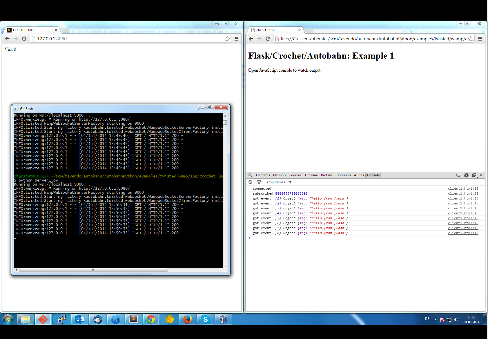

## Flask/WAMP Application using Crochet

This example demonstrates combining a Flask Web application with Autobahn WAMP code using [Crochet](https://crochet.readthedocs.org/).

### Running the Example

Install example dependencies:

```shell
pip install flask autobahn[twisted] crochet
```

Run a WAMP router, e.g. Crossbar.io

```
cd $HOME
mkdir mynode
cd mynode
crossbar init
crossbar start
```

> Above will start Crossbar.io with a WAMP-over-WebSocket transport listening on `ws://localhost:8080/ws` and a realm `realm1`.

Start the server-side component:


```shell
python server.py
```

Now open the WAMP Web client `client.html` in your browser, and then visit [http://localhost:8050](http://localhost:8050), reloading a couple of times.

You should see the Web client be notified in real-time of the new page visit count:


