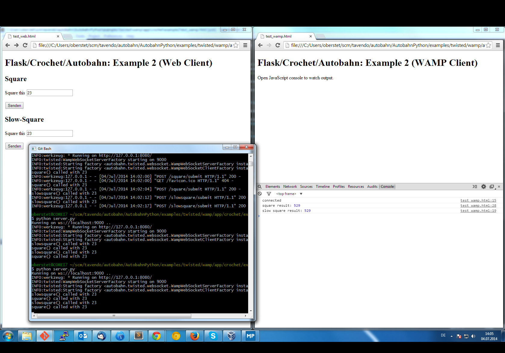

## Flask/WAMP Application using Crochet

This example demonstrates combining a Flask Web application with Autobahn WAMP code using [Crochet](https://crochet.readthedocs.org/).

### Running the Example

Install dependencies:

```shell
pip install flask autobahn[twisted] crochet
```

Start the server: 


```shell
python server.py
```

Now open the WAMP Web client `test_web.html` in your browser to test the (indirect) Web path to `square` and `slowsquare`, and `test_wamp.html` to test the (direct) WAMP path to those functions.


