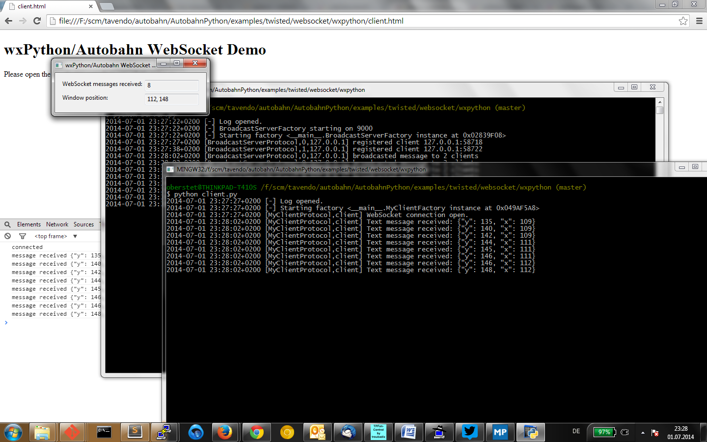

# Using wxPython with Autobahn

This example shows how to use WebSocket communication within a wxPython based application.

The demo creates a small Window that you can move around, and while doing so, the demo will send out WebSocket messages with the new Window position.

The demo will also receive WebSocket messages, count the number of received messages and display that number in the Window.

The server side of the demo runs a simple WebSocket broadcast server that will simply broadcast any WebSocket message it receives to all currently connected clients.

For fun, the demo also includes a HTML client which you can use to listen for all broadcasted events.

## How to run

Start the server

	python server.py

Start the wxPython client

	python client.py

Start the Web client by opening `client.html` in your browser.
